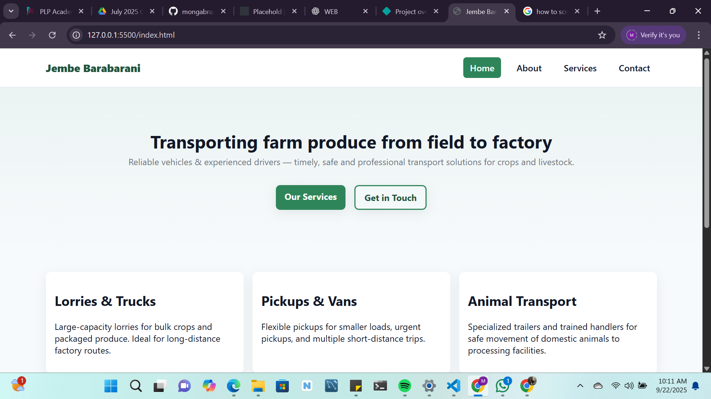
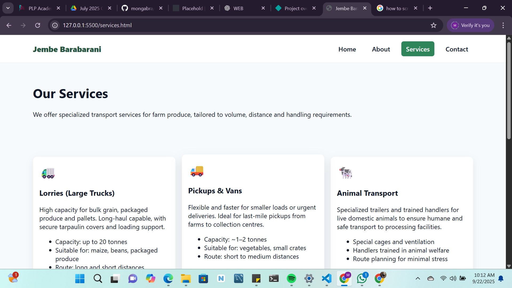

# 🌾 Jembe Barabarani

**Jembe Barabarani** is a responsive multipage website that showcases farm produce transportation services — moving crops and livestock from farm to factory. The website adopts a farm theme to reflect its purpose and highlight professionalism in transport operations.

---

## 📌 Features
- **Multipage design (4 pages):**
  - **Home** – welcoming hero section with CTA
  - **About** – vision and mission of the service
  - **Services** – available transport options and top drivers
  - **Contact** – phone, email, and social media links
- **Responsive navigation bar** with hamburger menu on mobile
- **Farm-themed design** (green, yellow, earthy tones)
- **Driver showcase** with vehicle categories
- **Footer** with social links

---

## 📂 Project Structure
├── index.html # Home page

├── about.html # About page

├── services.html # Services and driver showcase

├── contact.html # Contact information

├── style.css # Styling and responsive design

├── script.js # Mobile nav toggle (and interactivity)
yaml
Copy code

---

## 🛠️ Technologies Used
- **HTML5** – structure and semantic content
- **CSS3** – styling, layout, and responsive design
- **JavaScript** – navigation menu toggle and interactivity

---

## 🚀 Live Demo
👉 [View Live Site](https://your-demo-link.com)  
*(Replace with your GitHub Pages / Netlify / Vercel URL)*

---

## 📸 Screenshots
### Home Page

### Services Page

---

## 📞 Contact
- **Phone:** +254 712 345 678  
- **Email:** info@jembebarabarani.com  
- **Social Media:** Facebook | Twitter | Instagram  

---

## 📄 License
This project is for educational purposes.  
Feel free to use and customize it.
